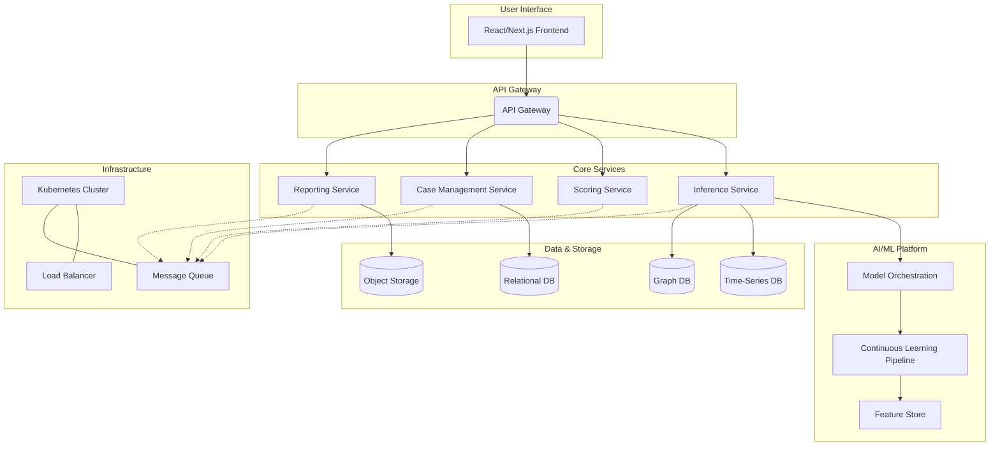

# FraudGuard AI Pro - System Architecture Blueprint

## 1. Introduction

This document outlines the proposed system architecture for transforming **FraudGuard AI Pro** into a world-class, enterprise-grade anti-fraud platform. The architecture is designed to be **scalable, resilient, and secure**, supporting advanced AI capabilities, real-time processing, and a rich user experience.

## 2. Architectural Principles

The architecture is founded on the following core principles:

- **Microservices Architecture**: The system will be decomposed into a set of loosely coupled, independently deployable microservices. This promotes scalability, fault isolation, and technology diversity.
- **Clean Architecture**: Each service will follow the principles of Clean Architecture, separating business logic from infrastructure and framework concerns.
- **Domain-Driven Design (DDD)**: Services will be modeled around business domains (e.g., `Inference`, `Scoring`, `CaseManagement`) to ensure a clear and maintainable structure.
- **Asynchronous Communication**: Asynchronous messaging (e.g., via Kafka or RabbitMQ) will be used for inter-service communication to enhance resilience and scalability.
- **CI/CD and DevOps**: A robust CI/CD pipeline will be established to automate testing, integration, and deployment, enabling rapid and reliable delivery of new features.

## 3. High-Level Architecture Diagram

## 4. Service Breakdown

The following table provides a breakdown of the initial set of microservices:

| Service                 | Description                                                                 | Technology Stack        |
|-------------------------|-----------------------------------------------------------------------------|-------------------------|
| **API Gateway**         | Single entry point for all client requests, handling routing, authentication. | Kong / Traefik          |
| **Inference Service**     | Executes ML models for real-time fraud prediction.                          | FastAPI (Python)        |
| **Scoring Service**       | Calculates a unified risk score based on model outputs and business rules.  | Go / Rust               |
| **Case Management**     | Allows analysts to investigate and manage fraud cases.                      | Django / Spring Boot    |
| **Reporting Service**     | Generates and delivers automated reports.                                   | Python (WeasyPrint)     |
| **Model Orchestration** | Manages the lifecycle of ML models (training, deployment, monitoring).      | Kubeflow / MLflow       |

## 5. Data Storage Strategy

- **InfluxDB**: For storing and querying time-series data for behavioral analytics.
- **Neo4j/DGraph**: For graph-based fraud detection, identifying complex fraud rings.
- **PostgreSQL/MySQL**: For transactional data, user management, and case management.
- **MinIO/S3**: For storing large data objects like reports, model artifacts, and audit logs.

## 6. Next Steps

1. **Establish Development Roadmap**: Create a detailed roadmap with epics and user stories.
2. **Set up CI/CD Pipeline**: Configure Jenkins or GitLab CI for automated builds and testing.
3. **Begin First Implementation Cycle**: Start with the `Inference Service` and a basic `Scoring Service`.

This architecture provides a solid foundation for building a powerful and future-proof anti-fraud platform. It will be refined and iterated upon as the project progresses.
